# 오픈시프트 가상화 기본

목차
1. [오픈시프트 가상화 개요(Overview) 대시보드](./openshift_virt_basic.md#1-오픈시프트-가상화-개요overview-대시보드)<br>
2. [가상머신 생성 및 관리](./openshift_virt_basic.md#2-가상머신-생성-및-관리)<br>
   2.1 [리눅스 가상머신 생성](./openshift_virt_basic.md#21-리눅스-가상머신-생성)<br>
   2.2 [가상머신 액세스](./openshift_virt_basic.md#22-가상머신-액세스)<br>
   &nbsp;&nbsp;&nbsp;&nbsp;&nbsp;2.2.1 [가상머신 콘솔 액세스](./openshift_virt_basic.md#221-가상머신-콘솔-액세스)<br>
   &nbsp;&nbsp;&nbsp;&nbsp;&nbsp;2.2.2 [가상머신과 연결된 리소스 검사](./openshift_virt_basic.md#222-가상머신과-연결된-리소스-검사)<br>
   2.3 [윈도우 가상머신 생성](./openshift_virt_basic.md#23-윈도우-가상머신-생성)<br>
3. [요약](./openshift_virt_basic.md#3-요약)
<br>

이 실습에서는 오픈시프트 가상화에서 가상머신을 생성하는 기본적인 방법을 소개합니다. 웹 콘솔을 통해 사전 정의된 템플릿에서 가상 머신을 만드는 방법을 살펴보겠습니다. 그런 다음 가상머신의 속성을 검토하고, 이어지는 다음 실습에서는 가상머신을 좀 더 자세히 커스터마이징 해 보겠습니다.

이 실습에서는 가상머신을 프로비저닝하는 두 가지 방법을 보여줍니다. 그러나 프로비저닝 방법은 다양하며 여기에 표시된 방법에만 국한되지는 않습니다. 가상머신을 프로비저닝 모든 방법으로 지원하는 운영체제에 적용할 수 있습니다.
<br>
<br>

## 1. 오픈시프트 가상화 Overview 대시보드

Overview 대시보드는 오픈시프트 가상화 및 가상머신의 상태에 대한 상태 정보와 함께 사용된 가상머신 및 리소스에 대한 클러스터 수준 보기를 제공합니다. 오픈시프트 가상화에서 일어나는 일을 빠르고 개괄적으로 파악하려는 관리자에게 유용한 시작점입니다.

1. 왼쪽 탐색 메뉴에서 **Virtualization** → **Overview**로 이동합니다. 
   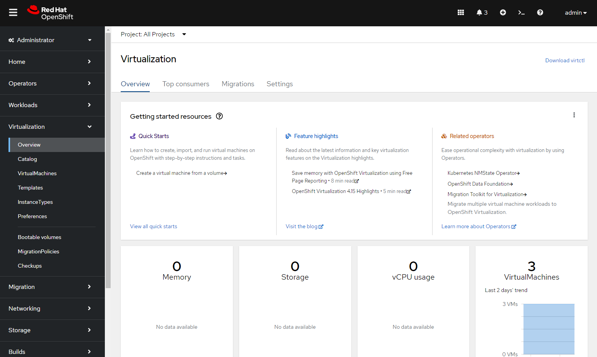 <br> 
   Overview 페이지는 오픈시프트 가상화 관리자에게 클러스터에 있는 가상머신의 글로벌 개요를 제공합니다. 일반 사용자는 자신의 프로젝트에 있는 가상머신만 볼 수 있습니다.

> [!NOTE]
> `Getting started resources` 패널이 표시되면, 해당 링크를 사용하여 가상머신을 생성하고 가상머신에 대한 사용자 지정 부팅 소스를 업로드하는 방법에 대한 단계별 안내를 하는 Quick Starts를 포함하여 오픈시프트 가상화에 대한 자세한 정보에 액세스할 수 있습니다. 패널 오른쪽 상단에 있는 점 3개 메뉴를 사용하여 패널을 숨길 수 있습니다. 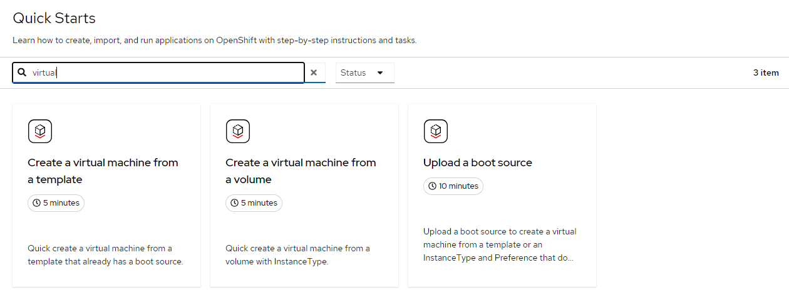
<br>

2. **Virtualization** → **Top consumers**를 검토합니다.
   
   페이지에서 아래로 스크롤하면 CPU, 메모리, 스토리지를 비롯한 다양한 리소스를 가장 많이 소비하고 있는 가상머신(Top consumers)이 표시됩니다. 새로 생성된 클러스터에는 가상머신 없으므로 처음에는 볼 것이 거의 없습니다. "View virtualization dashboard"를 클릭하여 측정항목을 더 자세히 알아볼 수도 있습니다. 그러면 더 많은 데이터와 그래프가 포함된 KubeVirt 측정항목 대시보드가 표시됩니다.

   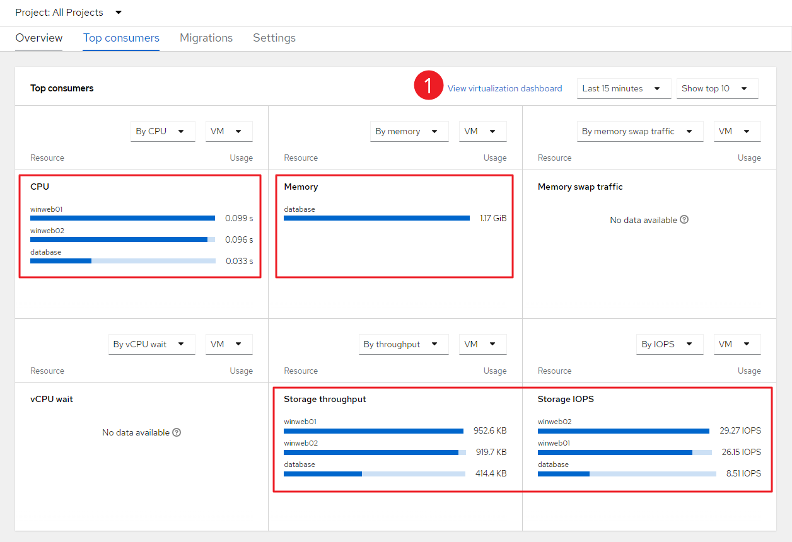 <br> 

> [!IMPORTANT]
> 여기에 리소스가 표시되지 않으면 랩에서 가상머신이 시작되지 않은 것입니다. Overview 세부정보를 보려면 이 세그먼트 이후에 이 페이지를 다시 방문하세요.
<br>
<br>

## 2. 가상머신 생성 및 관리

가상머신 생성은 가상화 관리자가 가장 자주 수행하는 작업 중 하나입니다. 이 섹션에서는 미리 생성된 템플릿을 사용하여 새 가상머신을 생성하는 과정을 안내합니다. 
<br>
가상화 관리자는 필요한 경우 자체 템플릿(회사의 표준규격 준수, 가상머신 크기 조정 옵션, *cloud-init* 또는 *sysprep*을 사용하여 추가적인 커스터마이징)을 생성할 수 있습니다.
<br>
이 랩에서는 레드햇 오픈시프트에서 가상머신을 실행하는 방법을 학습합니다. 오픈시프트 가상화에서 기본으로 제공하는 운영체제 디스크 이미지를 기반으로 새 가상머신을 생성합니다.
<br>
<br>
**목표**
* 새 가상머신 생성
* 가상머신 콘솔에 액세스
* 가상머신 콘솔을 사용해 경험 쌓기
<br>

### 2.1 리눅스 가상머신 생성

1. 왼쪽 메뉴에서 **Virtualization** → **VirtualMachines**로 이동합니다.
   
   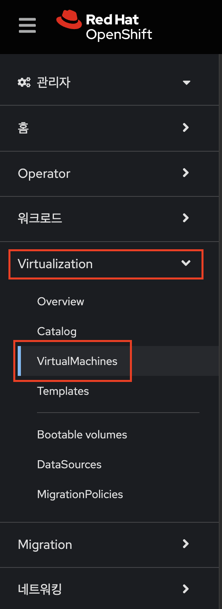 <br>

> [!NOTE]
> **Virtualization** 메뉴는 레드햇 오픈시프트 가상화가 설치되고 올바르게 구성된 경우에만 사용할 수 있습니다.
<br>

2. 가상머신을 만들기 전에 새 **프로젝트**를 만들어야 합니다. 
> [!NOTE]
> **프로젝트**는 오픈시프트의 다양한 객체들을 그룹화하고 격리하는 논리적인 단위 입니다.
> 가상 머신은 특정 프로젝트에 배포되며, 해당 프로젝트에 대한 권한이 없는 사용자는 가상머신에 액세스하거나 관리하거나 제어할 수 없습니다. 관리자는 모든 프로젝트에 액세스할 수 있으므로 모든 가상 머신을 볼 수 있지만 일반 사용자는 필요에 따라 프로젝트에 대한 액세스 권한을 부여받아야 합니다.
* 왼쪽 상단에 있는 **프로젝트: 모든 프로젝트**를 클릭한 다음 **프로젝트 만들기**를 클릭합니다.
      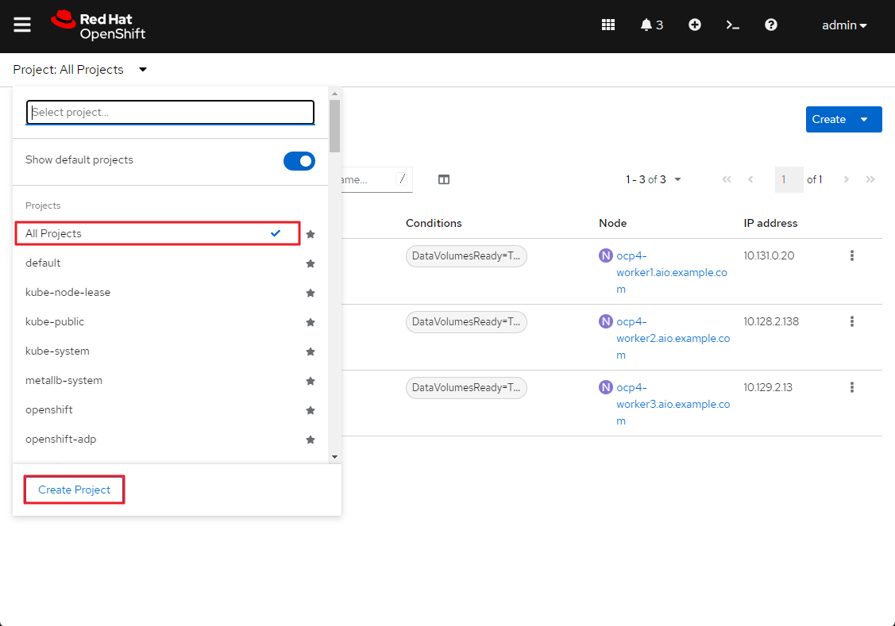 <br> 
* **이름** 필드에 `vmexamples`를 입력하여 프로젝트 이름을 입력한 다음 **만들기** 를 클릭합니다. 다른 이름을 입력하지 마시고 반드시 `vmexamples`를 입력하시길 바랍니다.
<br>
      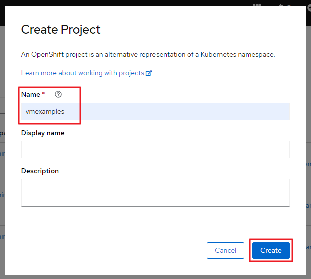 <br> 
<br>

3. 프로젝트의 이름 `vxexamples`인 것을 확인하고 **Create VirtualMachine**을 클릭합니다.

   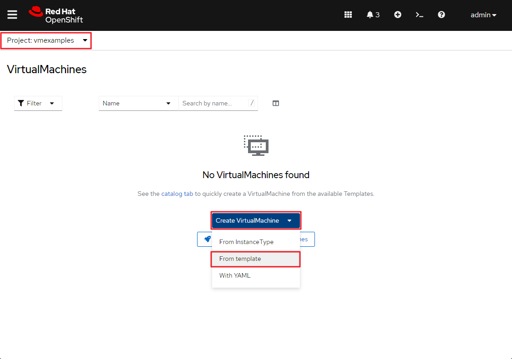 <br>

   사전 정의된 가상머신 템플릿을 보여주는 대시보드가 나타납니다.
   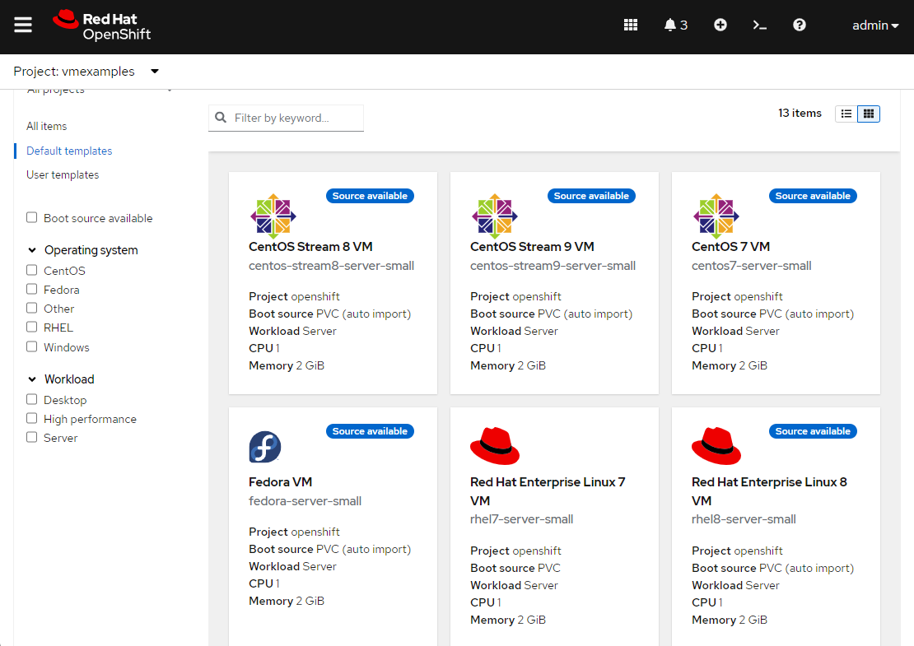 <br>
   사용 가능한 템플릿 목록을 확인해면 일부 템플릿에는 "소스 사용 가능(Source available)"이라고 적힌 파란색 배지가 있음을 알 수 있습니다. 오픈시프트에서 자동으로 다운로드하여 저장한 디스크를 사용하는 템플릿입니다. 별도의 디스크를 사용하려고 하는 경우, 자동 다운로드를 방지하고 커스터마이징된 디스크를 업로드할 수 있는 옵션도 있습니다.
<br>

4. 카탈로그의 검색창에서 `fedora`를 입력하여 **Fedora VM** 템플릿을 선택합니다.

   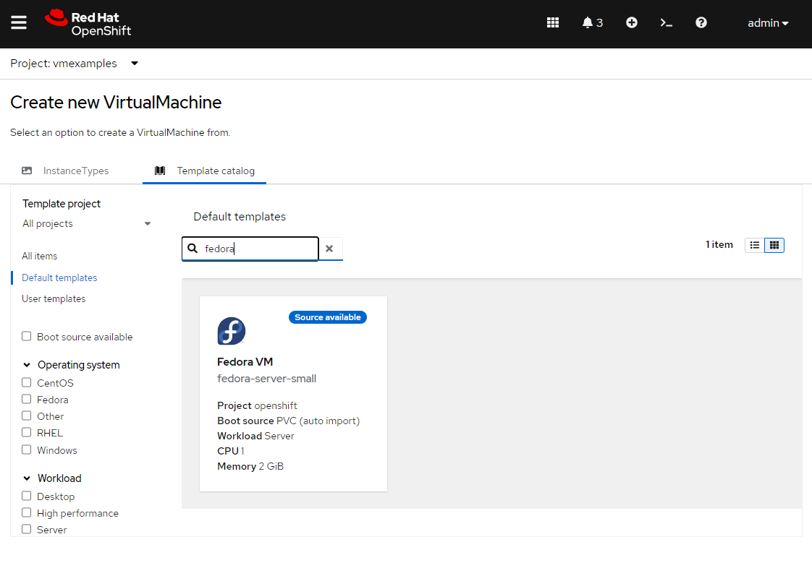 <br> 
<br>

5. **Fedora VM** 템플릿의 대화 상자를 확인합니다.

   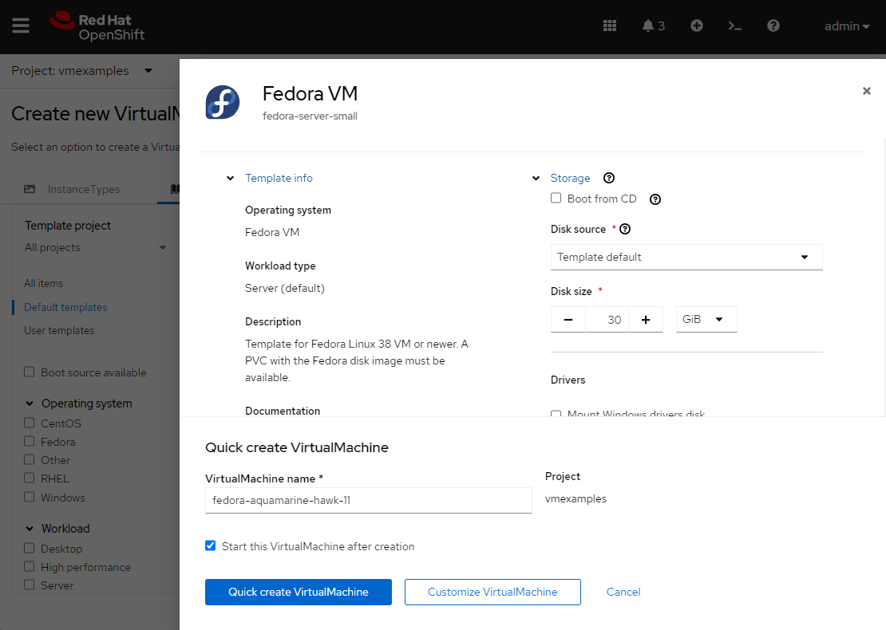 <br> 
<br>

6. 이름을 `fedora01`로 변경하고 **Quick create VirtualMachine**을 누릅니다.

   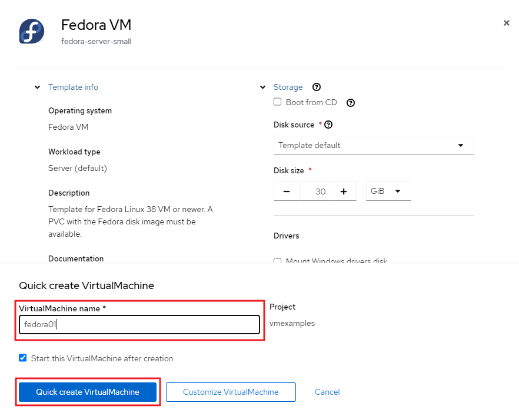 <br> 
<br>

7. 몇 초 후에 가상머신의 Status가 `Running`으로 바뀔 것 입니다. 그 시간 동안 스토리지 공급자는 새로 생성된 가상머신에서 사용할 수 있도록 템플릿 디스크를 복제했습니다. 소요되는 시간은 현재 VM에 사용 중인 스토리지 종류에 따라 다릅니다.

   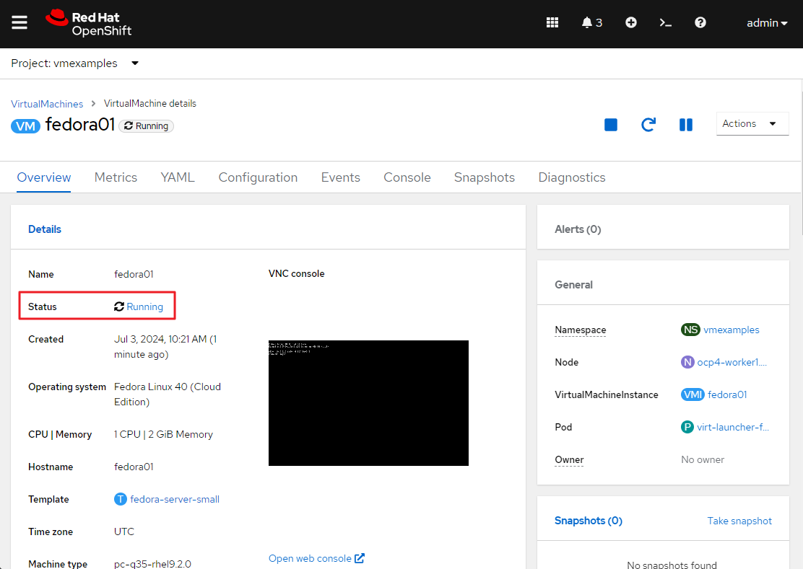 <br> 
<br>

8. 가상머신이 생성된 후 **Events** 탭을 클릭하여 가상머신 생성 및 실행 과정과 관련된 정보를 확인합니다. 가상머신 생성에 문제가 있는 경우에 이 탭에 표시됩니다.

   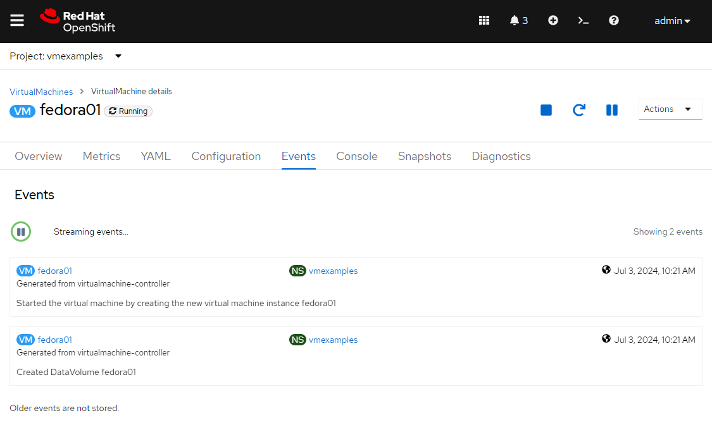 <br> 

   * *DataVolume*이 생성됩니다. *DataVolume*은 가상머신 디스크 생성을 관리하는 구성요소입니다(VM 디스크 정보를 입력하면 오픈시프트 네이티브 스토리지로 복제하거나 또는 가져오는 프로세스 진행).
   * 가상머신이 시작되었습니다.
<br>

9. 다시 **Overview** 탭을 클릭하여 가상머신 정보를 표시하는 기본 화면으로 돌아갑니다. 이 템플릿의 경우 기본값은 CPU 1개와 메모리 2GiB입니다. 관리자는 가상머신의 기본 구성을 사용자 정의하는 템플릿을 생성할 수 있습니다.
<br>
SDN(소프트웨어 정의 네트워크)에 있는 가상머신의 IP 주소도 이 페이지에 표시되며, 스토리지, 시스템 사용량, 가상머신을 호스팅하는 클러스터 노드 등에 대한 정보도 함께 표시됩니다.
<br>
    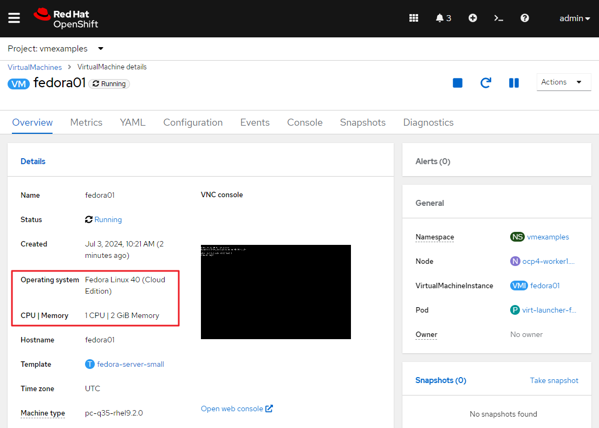 <br>
   기본적으로 VM은 기본 Pod 네트워크에 연결됩니다. 이 랩의 후반부에서는 고급 네트워킹 옵션과 VM에 대한 연결을 커스터마이징 하는 방법을 살펴보겠습니다.
<br>

### 2.2 가상머신 액세스

#### 2.2.1 가상머신 콘솔 액세스

1. **Console** 탭을 클릭하여 가상머신 콘솔에 액세스합니다.

   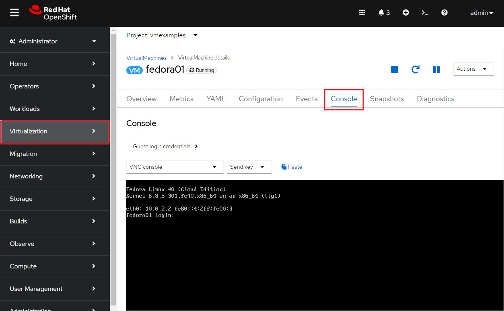 <br> 
<br>

2. `fedora` 사용자의 생성된 비밀번호를 보려면 **Guest login credentials**을 클릭합니다. 이는 오픈시프트 가상화의 기본 템플릿에서 제공되는 cloud-init를 사용하여 비밀번호를 설정한, 사용자 정의 가상머신의 경우에만 표시됩니다.

   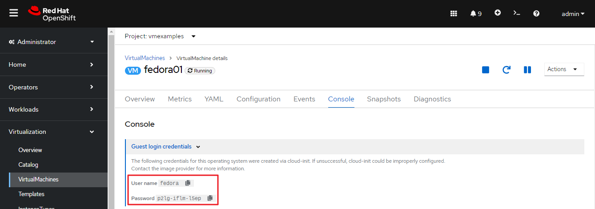 <br> 
<br>

3. `fedora` 사용자와 표시된 비밀번호를 사용하여 가상머신에 로그인합니다.

   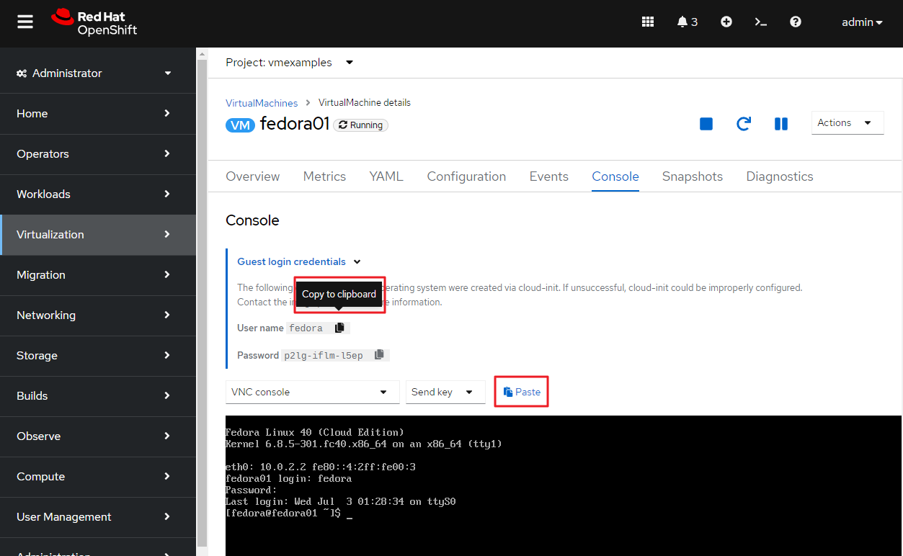 <br> 

> [!IMPORTANT]
> 비밀번호를 복사한 후 `붙여넣기(Paste)`를 클릭하여 비밀번호를 붙여넣을 수 있습니다.

> [!IMPORTANT]
> `붙여넣기(Paste)` 기능이 작동하지 않으면 콘솔 입력이 US 키맵을 사용하고 있다는 점을 고려하십시오. 한 가지 작은 요령은 올바른 문자(특히 `-` 문자가 올바른지)를 쓰고 있는지 확인하기 위해 로그인에 비밀번호를 쓰는 것입니다.
<br>

4. 로그인한 후 `ip a` 명령을 실행하여 인터페이스와 IP 주소를 표시합니다.

   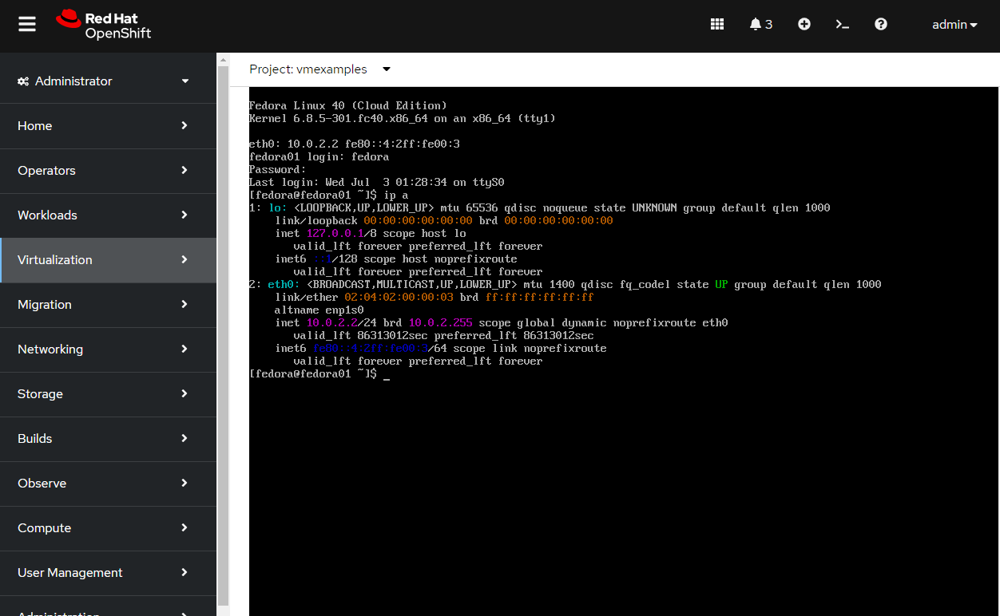 <br> 

   가상머신의 네트워크 어댑터는 SDN에 연결되어 있으므로 할당된 IP 주소는 *KVM 하이퍼바이저*에서 사용하는 내부 IP 주소입니다. 즉, 외부에서 액세스할 수 있는 IP가 아닙니다. 가상머신의 네트워크 설정에 대해서는 이후 실습에서 자세하게 다룹니다.
<br>

5. `lsblk`를 실행하여 디스크 목록과 해당 용량, 여유 공간을 표시합니다.

   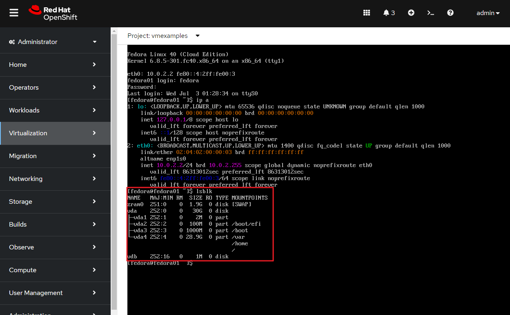 <br> 

   * `/dev/vda`는 가상머신 생성 단계에서 구성한 루트 디스크이며 지정된 크기(30G)로 생성된 것을 확인할 수 있습니다.
   * `/dev/vdb`는 `cloud-init`으로 필수 데이터(예: `fedora` 사용자 비밀번호 등) 구성에 사용됩니다. 이 디스크는 가상머신이 생성된 후 제거할 수 있습니다.
<br>

6. `nproc` 및 `free -m` 명령을 사용하여 가상머신과 연결된 CPU 수 및 메모리 크기(생성 중에 지정된 flavor와 일치)를 확합니다.

   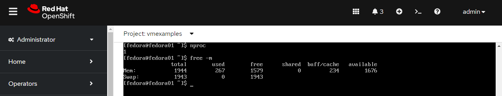 <br> 
<br>

7. `cloud-init`파일을 통해 커스터마이징된 GuestOS 정보를 확인하려면 `cloud-init` 디스크를 마운트합니다. <br>
   아래 명령어를 실행합니다.
   ```bash
      sudo mount /dev/vdb /mnt
   ```
   ```bash
      sudo cat /mnt/user-data; echo
   ```
   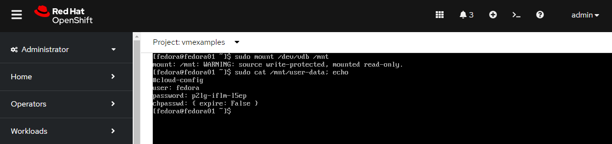 <br> 
<br>

8. QEMU 게스트 에이전트는 가상머신에서 실행되는 데몬으로, VM, 사용자, 파일 시스템 및 보조 네트워크에 대한 정보를 호스트에 전달합니다. <br>
   아래 명령어를 실행하여 에이전트를 확인합니다.
   ```bash
      systemctl | grep agent
   ```
   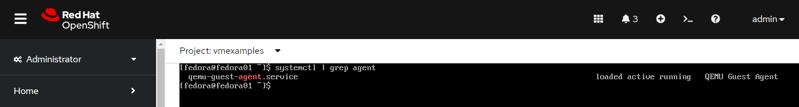 <br> 
> [!NOTE]
> 우리가 생성한 Fedora VM은 Red Hat에서 제공하는 OS이미지로 생성되어 에이전트가 사전에 설치되어 있지만, 
Red Hat에서 제공하지 않는 OS이미지에서 생성된 VM에는 QEMU 게스트 에이전트를 직접 설치해야 합니다.
<br>

10. **Overview** 탭을 클릭하여 게스트 가상머신의 기본 정보를 표시합니다.

   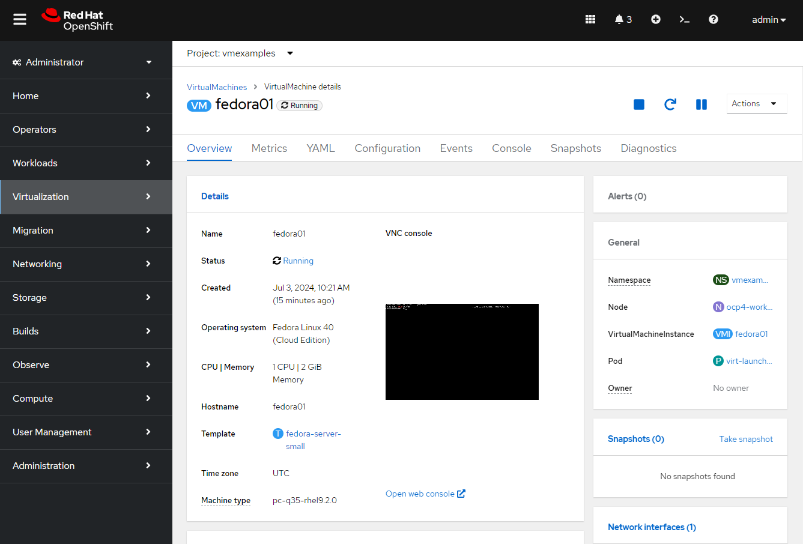 <br> 

   * 호스트 이름
   * 운영체제 버전 및 타임존 정보
   * 액티브 사용자
   * 사용량: CPU, 메모리, 스토리지 및 네트워크
<br>

11. **Metrics** 탭으로 이동하면 리소스 사용량에 대한 추가 정보를 얻을 수 있습니다.

    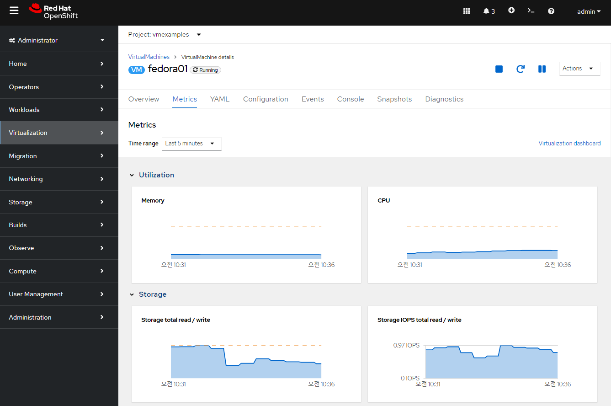 <br> 
<br>

#### 2.2.2 가상머신과 연결된 리소스 검사

**Configuration** 탭에서는 가상머신의 구성요소에 대한 설정이 가능합니다. 여기에는 7개의 하위 탭이 있습니다.

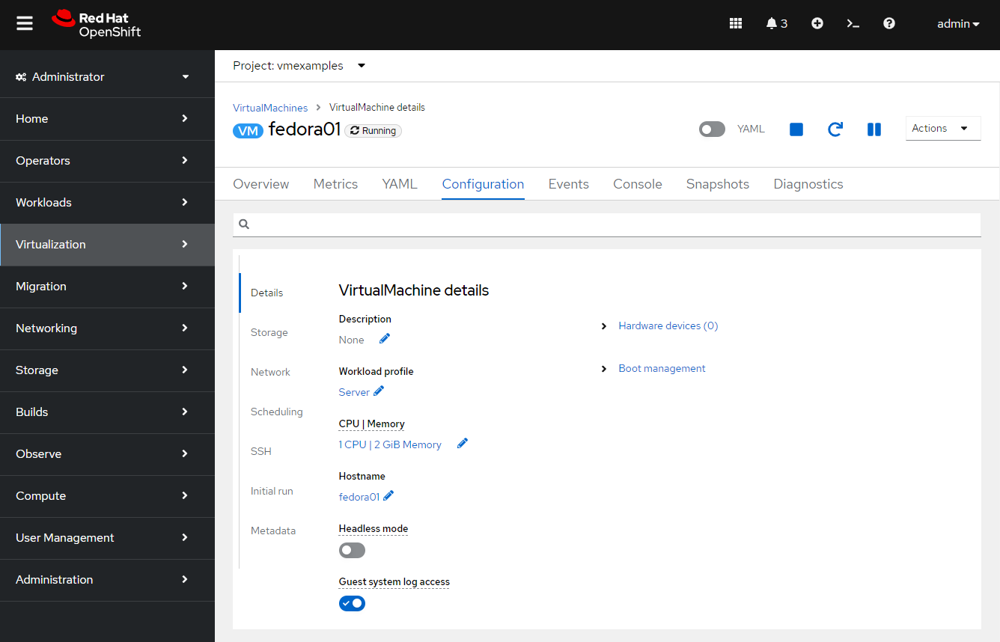 <br> 

* **Details**: 이 탭은 단일 패널에서 가상머신의 모든 물리적 기능을 제공합니다. 예를 들어 CPU 또는 메모리 수정, 호스트 이름 변경, 패스스루 장치(GPU, Host Devices) 연결, 부팅 순서 수정을 포함하여 기본 하드웨어적 구성을 편집할 수 있습니다.
* **Storage**: 이 탭은 시스템에 연결된 디스크를 나열하고 시스템에 새 디스크를 추가할 수 있도록 합니다. 게스트 에이전트가 설치된 경우 파일 시스템과 사용률이 표시됩니다. 또한 ConfigMaps, Secrets 및 Service Accounts를 추가 디스크로 연결할 수 있습니다. 이는 가상 머신에서 실행되는 애플리케이션에 설정 데이터(환경변수, 인증정보 등)를 전달할 때 유용합니다.
* **Network**: 이 탭은 가상머신에 구성된 현재 네트워크 인터페이스를 표시하며 새로운 네트워크 인터페이스를 추가할 수 있도록 합니다.
* **Scheduling**: 가상머신이 실행되어야 하는 위치와 가상머신 이동 시 따라야 할 전략을 나타내는 고급 구성을 설정합니다. 예를 들어 특정 노드에서만 실행되도록 하거나, 다른 노드로 가상머신을 이동 시 가상머신을 종료하지 않고 라이브 마이그레이션할 수 있습니다.
* **SSH**: 이 탭을 사용하면 현재 구성된 로드 밸런서에서 SSH 서비스를 생성하거나, 해당 기능이 활성화된 경우 Public SSH 키를 삽입하여 머신에 대한 원격 액세스를 설정할 수 있습니다.
* **Initial run**: 이 탭을 사용하면 Linux용 cloud-init 또는 Microsoft Windows용 sys-prep을 구성할 수 있으며, 이를 통해 SSH 키 주입, 애플리케이션 설치, 네트워크 구성 등 처음 부팅 시 실행되는 명령을 설정할 수 있습니다.
* **Metadata**: 이 탭은 가상머신에 적용된 현재 레이블과 주석을 보여줍니다. 이러한 값을 수정하면 특정 목적에 맞게 머신을 태그하거나 머신을 고유하게 식별하여 자동화된 워크플로를 활성화하는 데 도움이 될 수 있습니다.
<br>

1. **Network** 하위 탭을 클릭하여 가상머신에 연결된 네트워크 인터페이스를 확인합니다.

   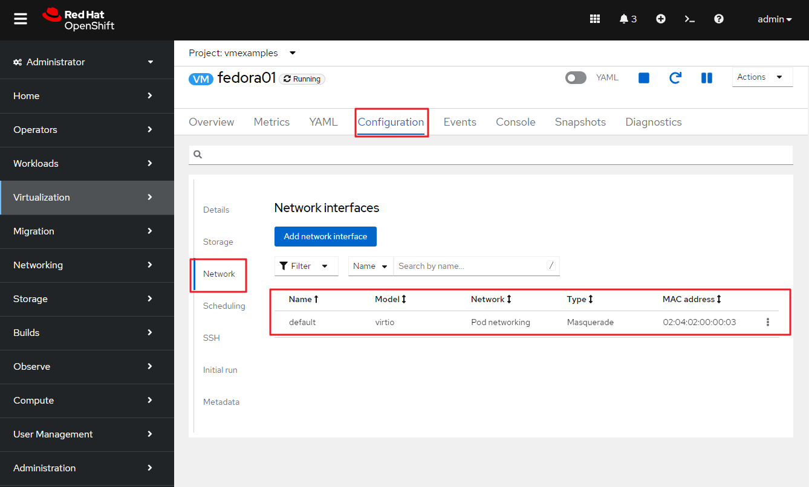 <br>
   가상머신이 생성되면 기본적으로 `PodNetworking` 네트워크에서 `masquerade` 유형의 인터페이스가 생성됩니다. 이를 통해 VM이 SDN에 연결되고 VM에서 OpenShift 클러스터 외부로 접근할 수 있습니다. 클러스터의 다른 VM과 Pod는 이 인터페이스를 사용하여 가상머신에 접속할 수 있습니다.
   SDN에 연결된 VM은 Route 또는 Service 유형을 사용하여 클러스터 외부에서도 접근할 수 있도록 설정 가능하지만, 오늘 실습에서는 이에 대해 다루지 않습니다.
<br>

2. **Storage** 하위 탭을 클릭하여 가상머신과 연결된 디스크를 나열합니다.

   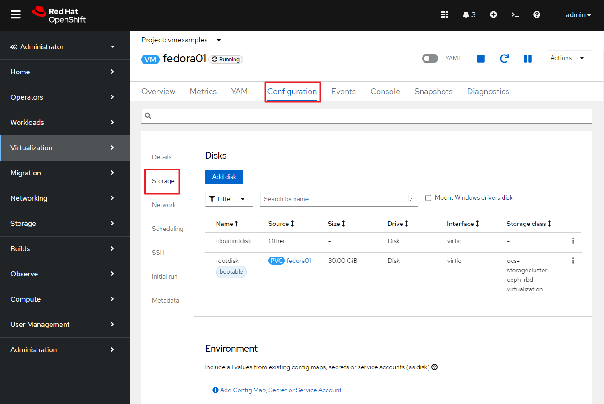 <br> 

   현재 환경에서 디스크에 사용되는 기본 StorageClass는 `ocs-external-storagecluster-ceph-rbd`입니다. 레드햇의 ODF(OpenShift Data Foundation)에서 블록 스토리지를 서비스하는 기본 StorageClass라고 이해하시면 됩니다.
   ODF 외에도 각 스토리지 제공자는 스토리지의 특성을 정의하는 다양한 스토리지 클래스가 있습니다(AWS의 `gp3`, VMware vSphere의 `thin-csi` 등).
<br>

### 2.3 윈도우 가상머신 생성

이번 랩에서는 웹 서버에서 호스팅되는 ISO를 사용하여 Microsoft Windows Server 2019를 설치합니다. 
<br>
이처럼 가상머신에 운영체제를 설치하기 위한 디스크 소스는 웹 서버, 오브젝트 스토리지, 오픈시프트 클러스터의 PVC 등 다양한 위치에서 가져올 수 있습니다.
<br>
이 과정은 초기 운영체제 설치 후 해당 가상머신 디스크를 복제하여 템플릿을 생성하면 생략할 수 있습니다. 템플릿으로 사용할 게스트 운영체제를 준비하는 구체적인 프로세스는 다양하므로 템플릿 운영체제를 준비할 때 조직의 지침 및 요구 사항을 따르십시오.
<br>
> [!NOTE]
> 이 부분을 진행할 때에는 현재 `vmexamples` 프로젝트에 있는지 먼저 확인하세요.
<br><br>

1. 왼쪽 메뉴에서 **Virtualization** → **VirtualMachines**로 이동합니다.

    <br>
<br>

2. 현재 프로젝트(`vmexamples`)에서 실행 중인 가상머신이 나열됩니다.

   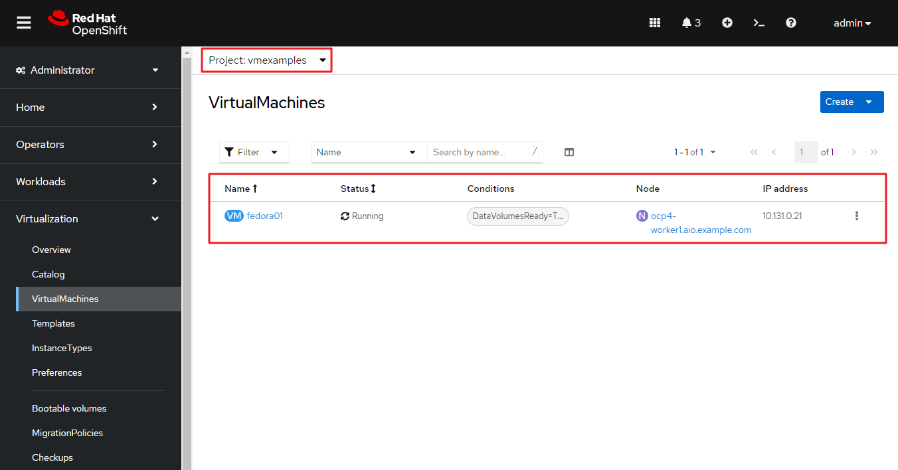 <br>
<br>

3. 오른쪽 상단의 **Create** 버튼을 누르고 `From template`을 선택합니다.

   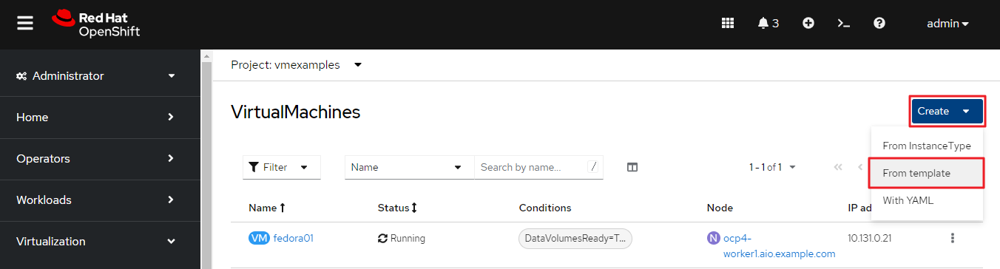 <br>
<br>

4. 검색 창에 *win* 입력 후 나타난 템플릿 중에 **Microsoft Windows Server 2019 VM** 타일을 선택합니다.

   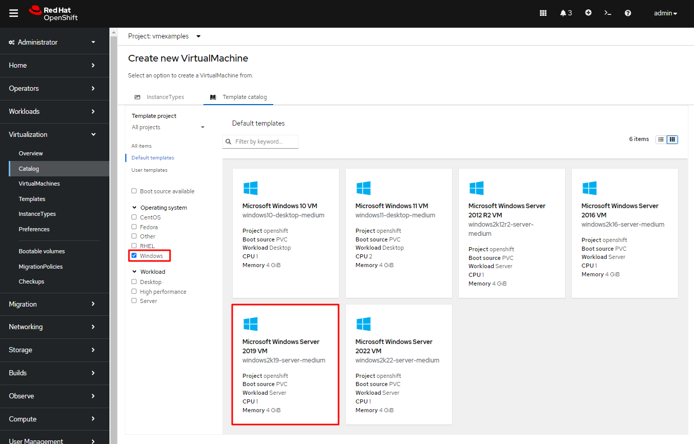 <br>
<br>

5. **Storage** 섹션에서 다음을 지정합니다.
   1. **VirtualMachine name**에 `windows` 입력
   2. **Boot from CD** 체크박스 활성화
   3. **CD Source**를 URL로 선택
   4. **Image URL**에 `https://catalog-item-assets.s3.us-east-2.amazonaws.com/qcow_images/Windows2019.iso` 를 입력
   5. **Disk size**를 **5GiB**로 설정하여 CD 크기를 줄임

6. 그 아래 **Disk source**는 그대로 두고 하단의 **Disk size**의 값도 기본값인 **60GiB**로 유지합니다.

7. **Drivers**에서 `Mount Windows drivers disk`가 활성화되어 있는지 확인합니다. 
이 드라이버는 Microsoft Windows 가상 머신을 OpenShift Virtualization에서 실행하는데 필요한 준가상화 장치 드라이버입니다.
virtio 드라이버가 없으면 준가상화된 하드웨어를 제대로 사용할 수 없으므로, 작동하지 않거나 심각한 성능 저하가 발생합니다.

8. 매개변수의 입력이 완료되면 바로 생성하지 말고, 오른쪽의 **Customize VirtualMachine**을 누릅니다. 
   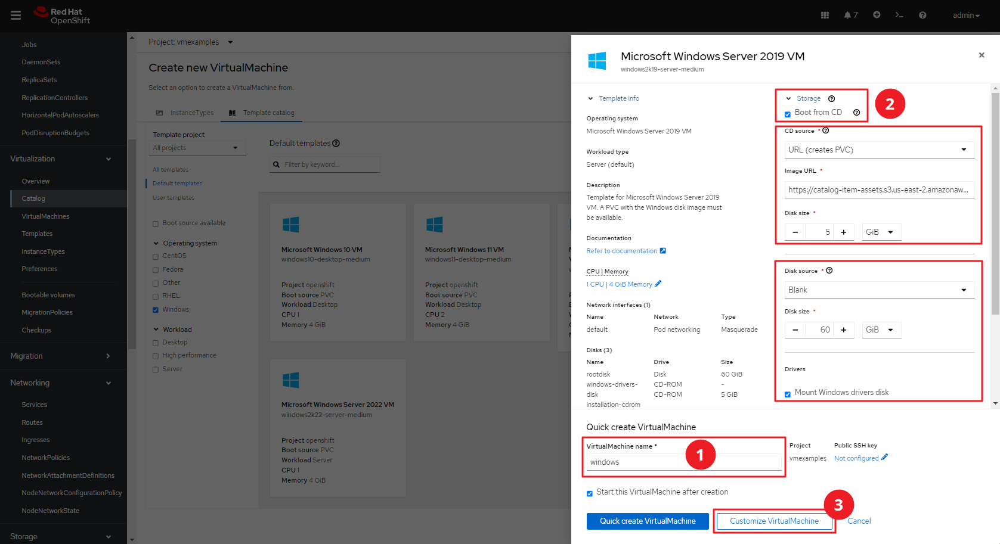 <br>
<br>

9. 커스터마이징 화면이 뜨면 **Boot mode** 옵션 옆에 있는 편집 연필 아이콘을 클릭합니다. 
    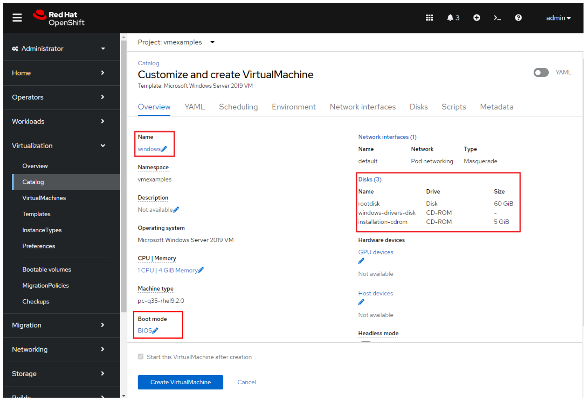 <br>
부팅모드 메뉴가 나타나면 드롭다운 메뉴에서 `BIOS` 부팅 모드를 선택합니다.
    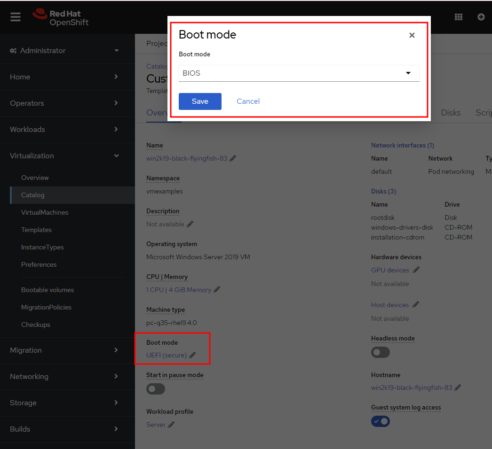 <br>
<br>

10. **Disk**탭에서 아래와 같이 installation-cdrom이 Book Disk의 첫 번째 순서로 되어있어야 하며, **bootable** 레이블이 적용되어 있어야 합니다. 이렇게 되어 있는 경우에는 11번으로 넘어가서 실습을 계속 진행합니다.
    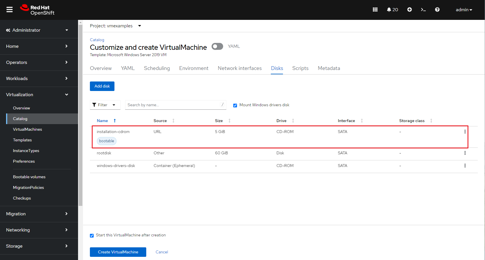 <br>
만약 **Disk** 메뉴에서 installation-cdrom이 boot의 첫 번째 순서가 아닌 경우에는 오른쪽 끝을 선택하여 Book Disk 순서를 아래 그림과 같이 변경합니다.
    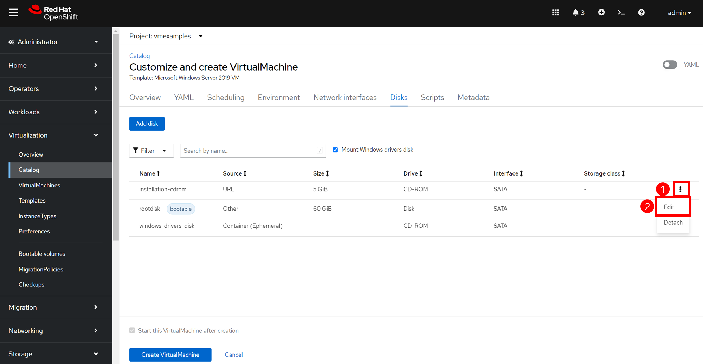 <br>
그리고 **Use this disk as a boot source**의 체크박스를 선택하고 **Save**를 누릅니다.
    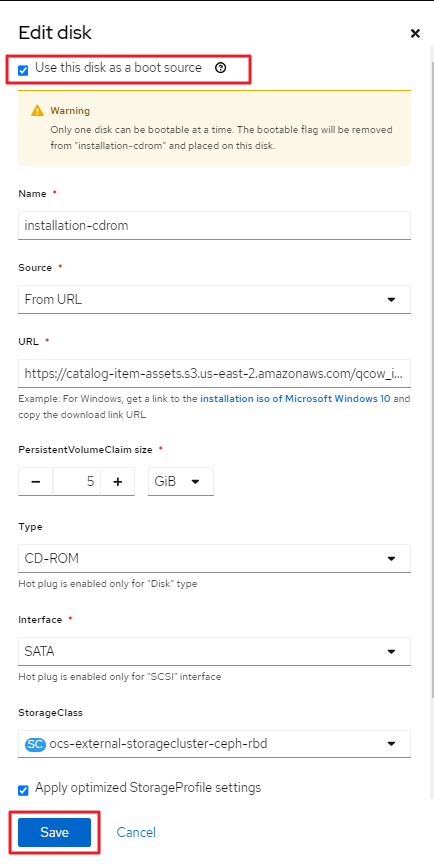 <br>
<br>

11. **Scripts** 탭으로 전환하고 **Sysprep** 섹션에서 **Edit**를 누릅니다.

    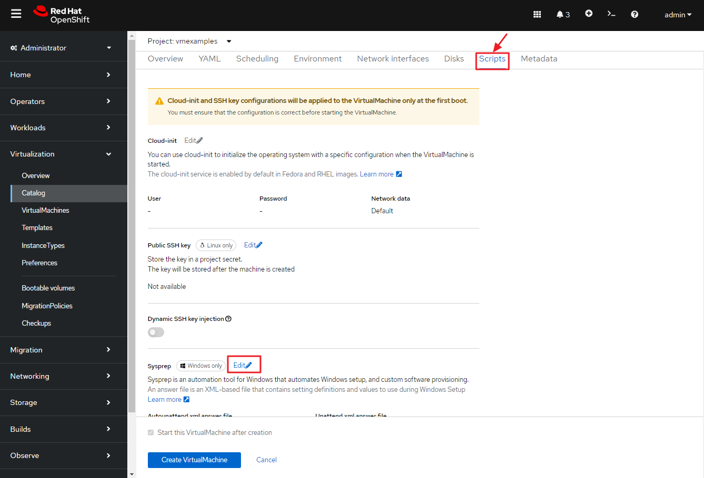 <br>
<br>

12. **Autounattend.xml answer file** 양식을 아래 `autounattend.xml`의 코드로 채웁니다. <br>
    **Autonattend.xml**은 Windows 설정 및 사용자 정의 소프트웨어 프로비저닝을 자동화하는 Window용 자동화 도구입니다. <br>
    Windows의 설치 단계마다 필요한 설정값을 미리 입력함으로써 사용자 입력 없이도 자동으로 설치가 완료되도록 하는 것입니다.

    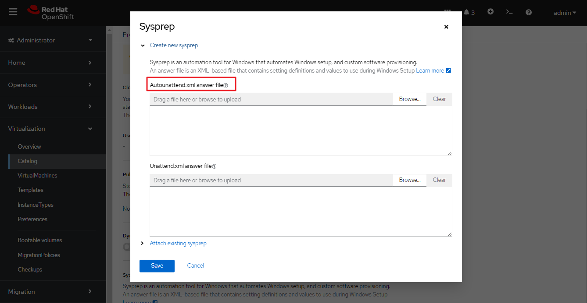 <br>

    `autounattend.xml` 파일  
    ```xml
    <?xml version="1.0" encoding="utf-8"?>
    <unattend xmlns="urn:schemas-microsoft-com:unattend" xmlns:wcm="http://schemas.microsoft.com/WMIConfig/2002/State" xmlns:xsi="http://www.w3.org/2001/XMLSchema-instance" xsi:schemaLocation="urn:schemas-microsoft-com:unattend">
      <settings pass="windowsPE">
        <component name="Microsoft-Windows-Setup" processorArchitecture="amd64" publicKeyToken="31bf3856ad364e35" language="neutral" versionScope="nonSxS">
          <DiskConfiguration>
            <Disk wcm:action="add">
              <CreatePartitions>
                <CreatePartition wcm:action="add">
                  <Order>1</Order>
                  <Extend>true</Extend>
                  <Type>Primary</Type>
                </CreatePartition>
              </CreatePartitions>
              <ModifyPartitions>
                <ModifyPartition wcm:action="add">
                  <Active>true</Active>
                  <Format>NTFS</Format>
                  <Label>System</Label>
                  <Order>1</Order>
                  <PartitionID>1</PartitionID>
                </ModifyPartition>
              </ModifyPartitions>
              <DiskID>0</DiskID>
              <WillWipeDisk>true</WillWipeDisk>
            </Disk>
          </DiskConfiguration>
          <ImageInstall>
            <OSImage>
              <InstallFrom>
                <MetaData wcm:action="add">
                  <Key>/IMAGE/NAME</Key>
                  <Value>Windows Server 2019 SERVERSTANDARD</Value>
                </MetaData>
              </InstallFrom>
              <InstallTo>
                <DiskID>0</DiskID>
                <PartitionID>1</PartitionID>
              </InstallTo>
            </OSImage>
          </ImageInstall>
          <UserData>
            <AcceptEula>true</AcceptEula>
            <FullName>Administrator</FullName>
            <Organization>My Organization</Organization>
          </UserData>
          <EnableFirewall>false</EnableFirewall>
        </component>
        <component name="Microsoft-Windows-International-Core-WinPE" processorArchitecture="amd64" publicKeyToken="31bf3856ad364e35" language="neutral" versionScope="nonSxS">
          <SetupUILanguage>
            <UILanguage>en-US</UILanguage>
          </SetupUILanguage>
          <InputLocale>en-US</InputLocale>
          <SystemLocale>en-US</SystemLocale>
          <UILanguage>en-US</UILanguage>
          <UserLocale>en-US</UserLocale>
        </component>
      </settings>
      <settings pass="offlineServicing">
        <component name="Microsoft-Windows-LUA-Settings" processorArchitecture="amd64" publicKeyToken="31bf3856ad364e35" language="neutral" versionScope="nonSxS">
          <EnableLUA>false</EnableLUA>
        </component>
      </settings>
      <settings pass="specialize">
        <component name="Microsoft-Windows-Shell-Setup" processorArchitecture="amd64" publicKeyToken="31bf3856ad364e35" language="neutral" versionScope="nonSxS">
          <AutoLogon>
            <Password>
              <Value>R3dh4t1!</Value>
              <PlainText>true</PlainText>
            </Password>
            <Enabled>true</Enabled>
            <LogonCount>999</LogonCount>
            <Username>Administrator</Username>
          </AutoLogon>
          <OOBE>
            <HideEULAPage>true</HideEULAPage>
            <HideLocalAccountScreen>true</HideLocalAccountScreen>
            <HideOnlineAccountScreens>true</HideOnlineAccountScreens>
            <HideWirelessSetupInOOBE>true</HideWirelessSetupInOOBE>
            <NetworkLocation>Work</NetworkLocation>
            <ProtectYourPC>3</ProtectYourPC>
            <SkipMachineOOBE>true</SkipMachineOOBE>
          </OOBE>
          <UserAccounts>
            <LocalAccounts>
              <LocalAccount wcm:action="add">
                <Description>Local Administrator Account</Description>
                <DisplayName>Administrator</DisplayName>
                <Group>Administrators</Group>
                <Name>Administrator</Name>
              </LocalAccount>
            </LocalAccounts>
          </UserAccounts>
          <TimeZone>Eastern Standard Time</TimeZone>
        </component>
      </settings>
      <settings pass="oobeSystem">
        <component name="Microsoft-Windows-International-Core" processorArchitecture="amd64" publicKeyToken="31bf3856ad364e35" language="neutral" versionScope="nonSxS">
          <InputLocale>en-US</InputLocale>
          <SystemLocale>en-US</SystemLocale>
          <UILanguage>en-US</UILanguage>
          <UserLocale>en-US</UserLocale>
        </component>
        <component name="Microsoft-Windows-Shell-Setup" processorArchitecture="amd64" publicKeyToken="31bf3856ad364e35" language="neutral" versionScope="nonSxS">
          <AutoLogon>
            <Password>
              <Value>R3dh4t1!</Value>
              <PlainText>true</PlainText>
            </Password>
            <Enabled>true</Enabled>
            <LogonCount>999</LogonCount>
            <Username>Administrator</Username>
          </AutoLogon>
          <OOBE>
            <HideEULAPage>true</HideEULAPage>
            <HideLocalAccountScreen>true</HideLocalAccountScreen>
            <HideOnlineAccountScreens>true</HideOnlineAccountScreens>
            <HideWirelessSetupInOOBE>true</HideWirelessSetupInOOBE>
            <NetworkLocation>Work</NetworkLocation>
            <ProtectYourPC>3</ProtectYourPC>
            <SkipMachineOOBE>true</SkipMachineOOBE>
          </OOBE>
          <UserAccounts>
            <LocalAccounts>
              <LocalAccount wcm:action="add">
                <Description>Local Administrator Account</Description>
                <DisplayName>Administrator</DisplayName>
                <Group>Administrators</Group>
                <Name>Administrator</Name>
              </LocalAccount>
            </LocalAccounts>
          </UserAccounts>
          <TimeZone>Eastern Standard Time</TimeZone>
        </component>
      </settings>
    </unattend>
    ```
<br>

13. 대화 상자에서 **저장(Save)** 을 클릭합니다.

    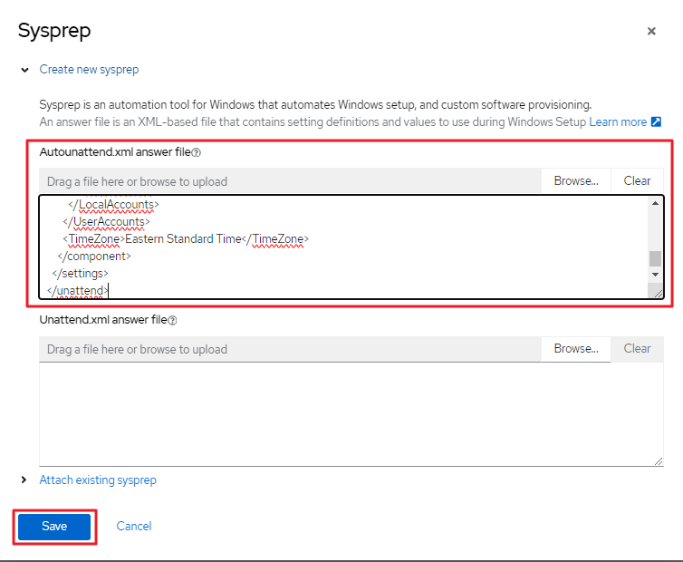 <br>
<br>

14. **Autounattend.xml answer file**에 설정된 값을 확인 후 **Create VirtualMachine**을 누릅니다.

    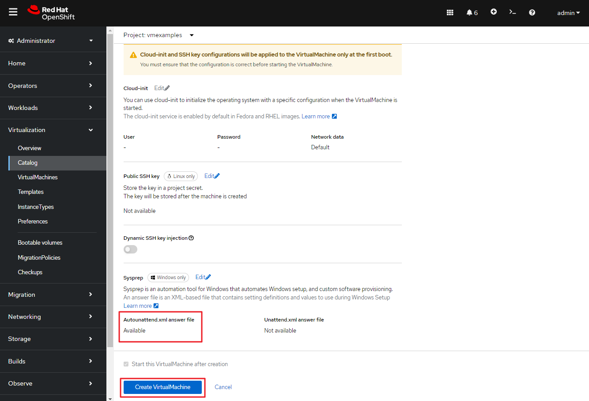 <br>
<br>

15. 가상머신은 ISO 이미지를 다운로드하고 인스턴스를 구성 및 시작하여 프로비저닝 프로세스를 시작합니다.

    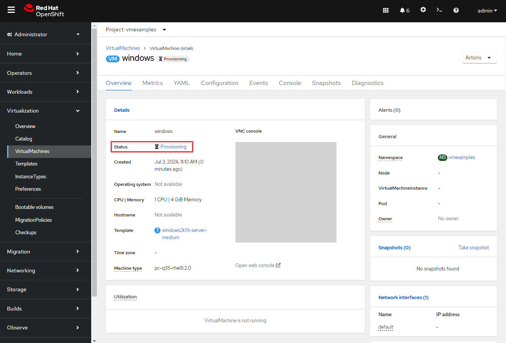 <br>
<br>

16. 몇 분 후에 가상머신의 Status 값이 `Running`으로 바뀝니다. **Console** 탭으로 전환합니다.

    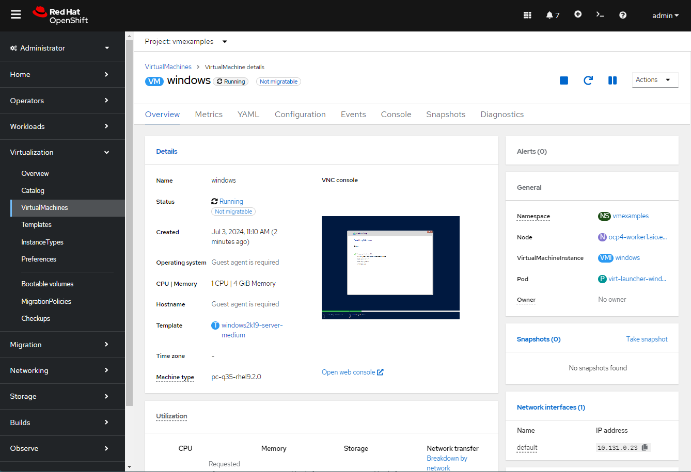 <br>

> [!NOTE]
> 설치가 완료될 때까지 기다릴 필요 없이 다음 단계를 계속 진행할 수 있습니다.

> [!IMPORTANT]
> CD-ROM 디스크가 연결되어 있으므로 가상머신은 "마이그레이션할 수 없음(Not migratable)"으로 표시됩니다.
<br>
<br>

## 3. 요약

이 실습에서는 오픈시프트 가상화에서 제공하는 데이터소스 템플릿을 사용하여 가상머신을 생성했습니다. 그런 다음 가상머신 속성을 확인하고 기본 제공 콘솔을 사용하여 가상머신에 접속했습니다.
그런 다음 웹 서버 상에 위치한 ISO 디스크 이미지를 사용하여 새 윈도우 가상머신을 만들었습니다.

다음 실습에서는 가상머신을 커스터마이징하고 관리하는 방법을 확인합니다.
<br>
<br>

HOW TO GET virtctl
```bash
wget --no-check-certificate https://hyperconverged-cluster-cli-download-openshift-cnv.apps.ocp.example.com/amd64/linux/virtctl.tar.gz
```
------
[차례](../../README.md) &nbsp;&nbsp;&nbsp;&nbsp; [<< 랩 환경 <<](./lab_review.md) &nbsp;&nbsp;&nbsp;&nbsp; [>> 오픈시프트 가상화 커스터마이징 >>](./openshift_virt_customization.md)
